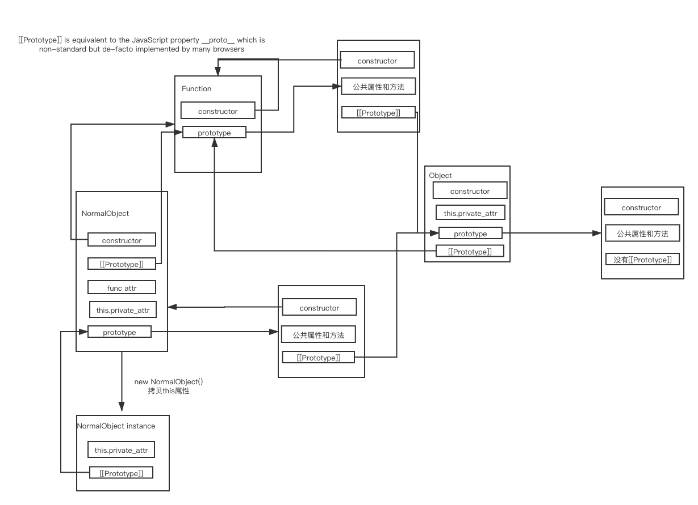

## 基础知识

### prototype chain

- 原型获取,修改相关函数

    Object.getPrototypeOf() and Object.setPrototypeOf()

- Inheriting "methods"
  
  When an inherited function is executed, the value of **this** points to the inheriting object, not to the prototype object where the function is an own property.

        var o = {
        a: 2,
        m: function() {
            return this.a + 1;
        }
        };

        console.log(o.m()); // 3
        // When calling o.m in this case, 'this' refers to o

        var p = Object.create(o);
        // p is an object that inherits from o

        p.a = 4; // creates a property 'a' on p
        console.log(p.m()); // 5
        // when p.m is called, 'this' refers to p.
        // So when p inherits the function m of o, 
        // 'this.a' means p.a, the property 'a' of p

- Different ways to create objects and the resulting prototype chain

        var o = {a: 1};

        // o ---> Object.prototype ---> null

        var b = ['yo', 'whadup', '?'];

        // b ---> Array.prototype ---> Object.prototype ---> null

        function f() {
        return 2;
        }

        // f ---> Function.prototype ---> Object.prototype ---> null

- 对象创建

    - With a constructor

        A "constructor" in JavaScript is "just" a function that happens to be called with the new operator.

            function Graph() {
                this.vertices = [];
                this.edges = [];
            }

            Graph.prototype = {
                addVertex: function(v) {
                    this.vertices.push(v);
                }
            };

            var g = new Graph();
            // g is an object with own properties 'vertices' and 'edges'.
            // g.[[Prototype]] is the value of Graph.prototype when new Graph() is executed

    - With Object.create

        ECMAScript 5 introduced a new method: Object.create(). Calling this method creates a new object. The prototype of this object is the first argument of the function:

            var a = {a: 1}; 
            // a ---> Object.prototype ---> null

            var b = Object.create(a);
            // b ---> a ---> Object.prototype ---> null
            console.log(b.a); // 1 (inherited)

            var c = Object.create(b);
            // c ---> b ---> a ---> Object.prototype ---> null

            var d = Object.create(null);
            // d ---> null
            console.log(d.hasOwnProperty); 
            // undefined, because d doesn't inherit from Object.prototype

    - delete Operator with Object.create and new operator

            var a = {a: 1};

            var b = Object.create(a); 

            console.log(a.a); // print 1 
            console.log(b.a); // print 1
            b.a=5;
            console.log(a.a); // print 1
            console.log(b.a); // print 5
            delete b.a;
            console.log(a.a); // print 1
            console.log(b.a); // print 1(b.a value 5 is deleted but it showing value from its prototype chain)
            delete a.a;
            console.log(a.a); // print undefined
            console.log(b.a); // print undefined

- hasOwnProperty检查是否是对象自身属性, 而不是原型属性

        console.log(g.hasOwnProperty('vertices'));
        // true

        console.log(g.hasOwnProperty('nope'));
        // false

        console.log(g.hasOwnProperty('addVertex'));
        // false

        console.log(g.__proto__.hasOwnProperty('addVertex'));
        // true

- prototype and Object.getPrototypeOf

    var a1 = new A(); var a2 = new A()

    Object.getPrototypeOf(a1).doSomething == Object.getPrototypeOf(a2).doSomething == A.prototype.doSomething

    when you call

        var o = new Foo();

    JavaScript actually just does

        var o = new Object();
        o.[[Prototype]] = Foo.prototype;
        Foo.call(o); 

    /* 
        上述代码非常关键， 尤其最后一行会严重影响Foo函数中this的作用域，
        下面对js this玩法做一个总结
    */   

- JavaScript this 关键词指的是它所属的对象。它拥有不同的值，具体取决于它的使用位置:

- 在方法中，this 指的是所有者对象。

    var person = {
        firstName: "Bill",
        lastName : "Gates",
        id       : 678,
        fullName : function() {
            return this.firstName + " " + this.lastName;
        }
    };

- 单独的情况下，this 指的是全局对象 [object Window]。

    var x = this;

- 在严格模式中，如果单独使用，那么 this 指的是全局对象 [object Window]：

    "use strict";
    var x = this;

- 函数中的 this（默认）
    
    在 JavaScript 函数中，函数的拥有者默认绑定 this。

    因此，在函数中，this 指的是全局对象 [object Window]

        function myFunction() {
        return this;
        }

- 函数中的 this（严格模式）

    JavaScript 严格模式不允许默认绑定。

    因此，在函数中使用时，在严格模式下，this 是未定义的（undefined）。

        "use strict";
        function myFunction() {
        return this;
        }

- 事件处理程序中的 this

    在 HTML 事件处理程序中，this 指的是接收此事件的 HTML 元素：

        <button onclick="this.style.display='none'">
            点击来删除我！
        </button>

- 对象方法绑定

    在此例中，this 是 person 对象（person 对象是该函数的“拥有者”）：

        var person = {
            firstName  : "Bill",
            lastName   : "Gates",
            id         : 678,
            myFunction : function() {
                return this;
            }
        };

- 显式函数绑定

    call() 和 apply() 方法是预定义的 JavaScript 方法。

    它们都可以用于将另一个对象作为参数调用对象方法。

    您可以在本教程后面阅读有关 call() 和 apply() 的更多内容。

    在下面的例子中，当使用 person2 作为参数调用 person1.fullName 时，this 将引用 person2，即使它是 person1 的方法：

        var person1 = {
        fullName: function() {
            return this.firstName + " " + this.lastName;
        }
        }
        var person2 = {
        firstName:"Bill",
        lastName: "Gates",
        }
        person1.fullName.call(person2);  // 会返回 "Bill Gates"

### 基础数据类型

- Number

    Numbers in JavaScript are **"double-precision 64-bit format IEEE 754 values"**, according to the spec —  There's no such thing as an integer in JavaScript (except BigInt), so you have to be a little careful. See this example:

        console.log(3 / 2);             // 1.5, not 1
        console.log(Math.floor(3 / 2)); // 1

        0.1 + 0.2 == 0.30000000000000004;

        parseInt('123', 10); // 123

        parseInt('010');  //  8
        parseInt('0x10'); // 16

        parseInt('11', 2); // 3

        parseInt('hello', 10); // NaN("Not a Number")

        NaN + 5; // NaN

        isNaN(NaN); // true

        1 / 0; //  Infinity
        -1 / 0; // -Infinity

        isFinite(1 / 0); // false
        isFinite(-Infinity); // false
        isFinite(NaN); // false

- String

    Strings in JavaScript are sequences of Unicode characters. This should be welcome news to anyone who has had to deal with internationalization. More accurately, they are sequences of UTF-16 code units; each code unit is represented by a 16-bit number. Each Unicode character is represented by either 1 or 2 code units.

        'hello'.length; // 5

        'hello'.charAt(0); // "h"
        'hello, world'.replace('world', 'mars'); // "hello, mars"
        'hello'.toUpperCase(); // "HELLO"

- Boolean

    - false, 0, empty strings (""), NaN, null, and undefined all become false.

    - All other values become true.

- Symbol(new in ES2015)
- Object
    - Function
    - Array
    - Date
    - RegExp
- null

    indicates a deliberate non-value (and is only accessible through the null keyword), 

- undefined

    indicates an uninitialized variable 

### Variables

- let : allows you to declare **block-level** variables. The declared variable is available from the block it is enclosed in

        let a;
        let name = 'Simon';

  - The following is an example of scope with a variable declared with let:

        // myLetVariable is *not* visible out here

        for (let myLetVariable = 0; myLetVariable < 5; myLetVariable++) {
        // myLetVariable is only visible in here
        }

        // myLetVariable is *not* visible out here

- const : allows you to declare variables whose values are never intended to change. The variable is available from the **block** it is declared in.

- var : A variable declared with the var keyword is available from the **function** it is declared in.

        // myVarVariable *is* visible out here

        for (var myVarVariable = 0; myVarVariable < 5; myVarVariable++) { 
        // myVarVariable is visible to the whole function 
        } 

        // myVarVariable *is* visible out here 

### Operators

- numeric operators

        +, -, *, / and %  
        
        += and -=
        
        ++ and -- 

  - The + operator also does string concatenation:

      'hello' + ' world'; // "hello world"

- Comparisons 

        <, >, <= and >=

        123 == '123'; // true

        1 == true; // true

    To avoid type coercion, use the triple-equals operator:

        123 === '123'; // false
        1 === true;    // false

    There are also != and !== operators.

### Control structures

- if and else

        var name = 'kittens';
        if (name == 'puppies') {
        name += ' woof';
        } else if (name == 'kittens') {
        name += ' meow';
        } else {
        name += '!';
        }
        name == 'kittens meow';

- while loops and do-while loops

        while (true) {
        // an infinite loop!
        }

        var input;
        do {
        input = get_input();
        } while (inputIsNotValid(input));

- for loop 

        for (var i = 0; i < 5; i++) {
        // Will execute 5 times
        }

- for array : for...of

        for (let value of array) {
        // do something with value
        }

- for object : for...in:

        for (let property in object) {
        // do something with object property
        }

- The && and || operators use short-circuit logic,

        var name = o && o.getName();

        var name = cachedName || (cachedName = getName());

        var allowed = (age > 18) ? 'yes' : 'no';

- ternary operator 

        var allowed = (age > 18) ? 'yes' : 'no';

- switch statement

        switch (action) {
            case 'draw':
                drawIt();
                break;
            case 'eat':
                eatIt();
                break;
            default:
                doNothing();
        }

    - fallthrough

            switch (a) {
            case 1: // fallthrough
            case 2:
                eatIt();
                break;
            default:
                doNothing();
            }

    - You can have expressions in both the switch part and the cases if you like

        comparisons take place between the two using the === operator:

            switch (1 + 3) {
            case 2 + 2:
                yay();
                break;
            default:
                neverhappens();
            }

### Object